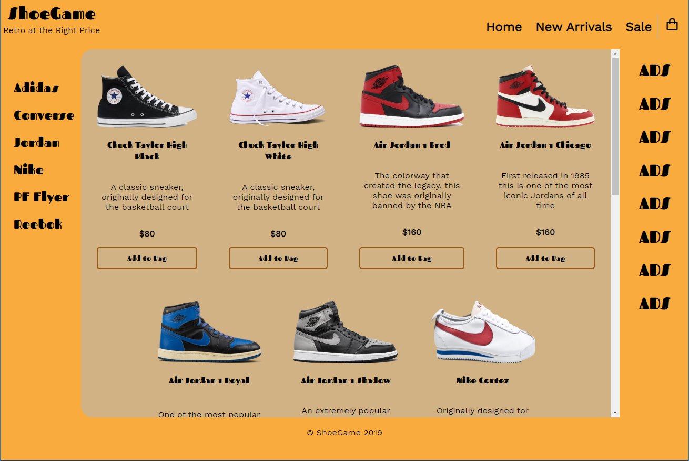

### ShoeGame

*A 70's themed e-commerce site. See it live [here.](https://gauraklein.github.io/shoegame/)*

This project was created as a practical application of rendering from Javascript Objects. Through this project I expanded my understanding of Jquery as well as the Javascript map method. I decided on an e-commerce site so that I could further understand the concept of a "cart" and using click events to add and remove items.

## Technologies Used
- Jquery
- .map()
- HTML
- CSS
